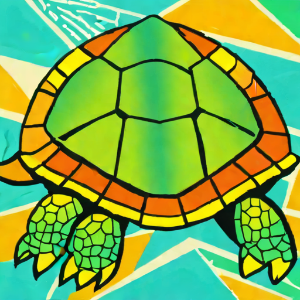
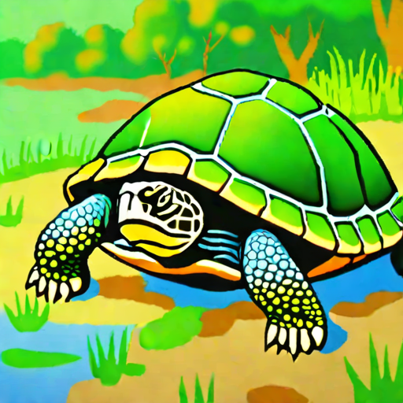
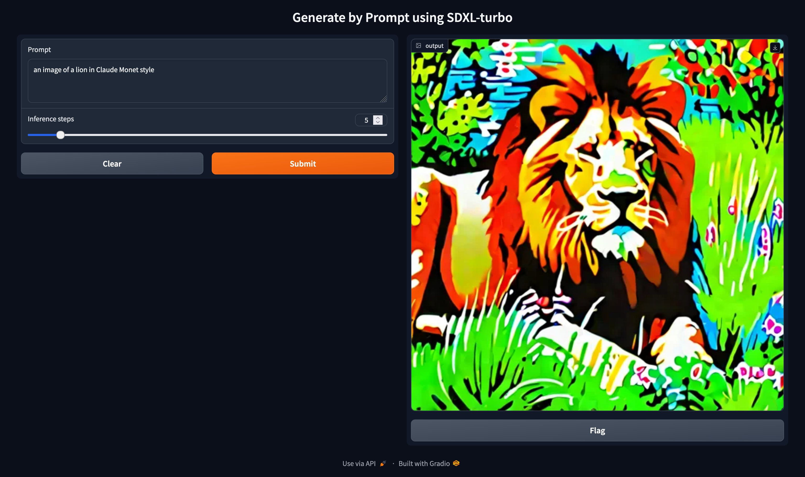

# Generating by prompts using SDXL-turbo

## Introduction

We implement a module that generates images based on user-defined (text) prompts. We use the pretrained [Stable Diffusion XL-Turbo](https://huggingface.co/stabilityai/stable-diffusion-xl-base-1.0) provided by *stabilityai* at HuggingFace, while preparing the module.

## Setting Up the Environment

### Using Conda (recommended)

1. Install [Conda](https://conda.io/projects/conda/en/latest/user-guide/install/index.html), if not already installed.
2. Clone the repository:
    ~~~
    git clone https://github.com/byrkbrk/generating-by-prompt-sdxl-turbo.git
    ~~~
3. Change the directory:
    ~~~
    cd generating-by-prompt-sdxl-turbo
    ~~~
4. Create the environment:
    ~~~
    conda env create -f generating-by-prompt-sdxl-turbo.yaml
    ~~~
5. Activate the environment:
    ~~~
    conda activate generating-by-prompt-sdxl-turbo
    ~~~

### Using Pip 

1. Download & install [Python](https://www.python.org/downloads/) (version==3.11)
2. Clone the repository:
    ~~~
    git clone https://github.com/byrkbrk/generating-by-prompt-sdxl-turbo.git
    ~~~
3. Change the directory:
    ~~~
    cd generating-by-prompt-sdxl-turbo
    ~~~
4. Install packages using `pip`:
    ~~~
    pip install -r requirements.txt
    ~~~

## Generating Images

Check it out how to use:

~~~
python3 generate.py -h
~~~

Output:

~~~
Generate images by prompts using SDXL-turbo

positional arguments:
  prompt                Text prompts that be used for generating

options:
  -h, --help            show this help message and exit
  --num_inference_steps NUM_INFERENCE_STEPS
                        Number of inferences steps that be used during
                        inference. Default: 5
  --device DEVICE       Device name used for inferece. Default: None
  --height HEIGHT       Height of the generated image. Default: 512
  --width WIDTH         Width of the generated image. Default: 512
~~~

### Example usage

~~~
python3 generate.py\
 "an image of turtle in Picasso style"\
 "an image of turtle in Camille Pissarro style"\
 --num_inference_steps 10
~~~

The output images seen below (left: Picasso style, right: Pissarro style) will be saved into `generated-images` folder.

  
  

## Generating Images by Gradio

To run the gradio app on your local computer, execute:

~~~
python3 app.py
~~~
Then, visit the url [http://127.0.0.1:7860](http://127.0.0.1:7860) to open the interface.

### Example usage

See the display below for an example usage of the module via Gradio for the prompt `'a picture of a lion in Claude Monet style'` with `inference steps` of 5.

  

